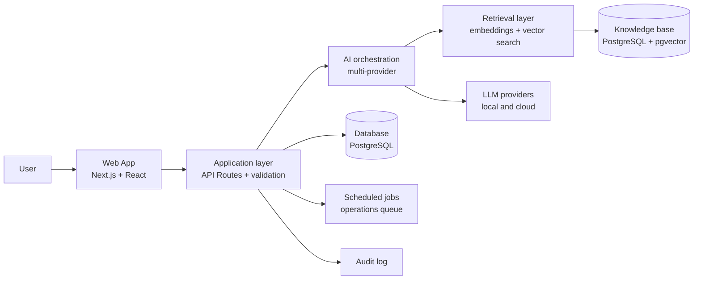
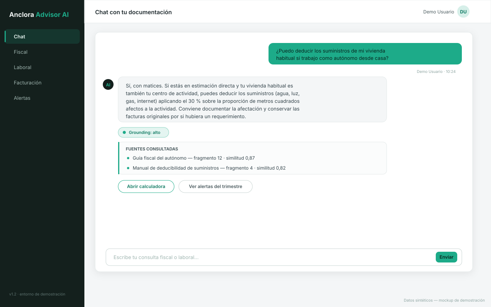
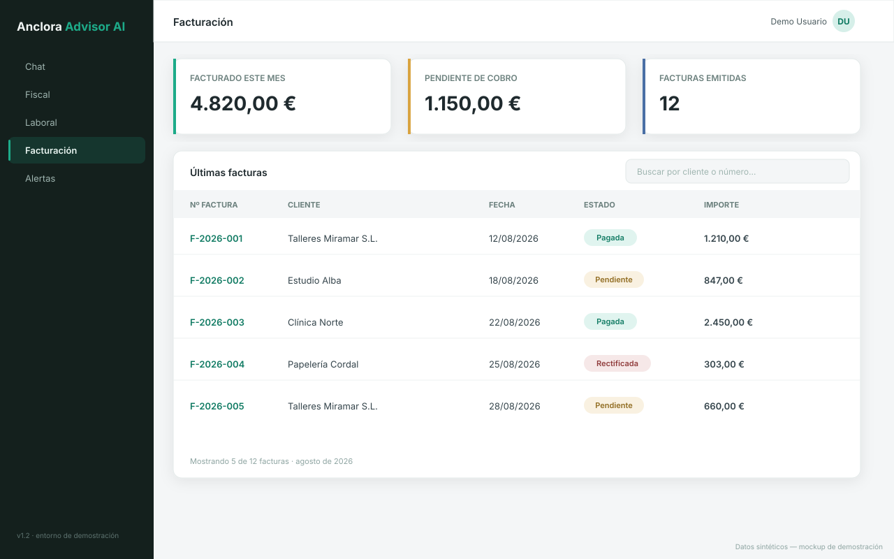
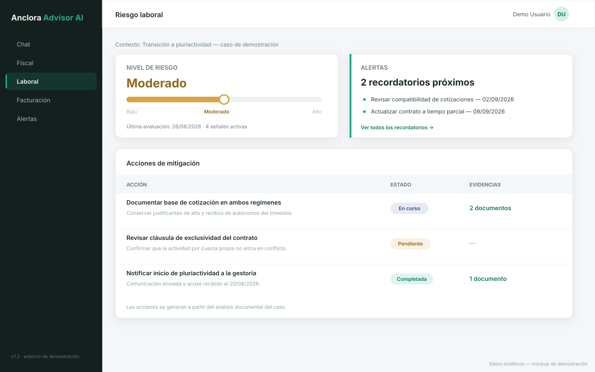
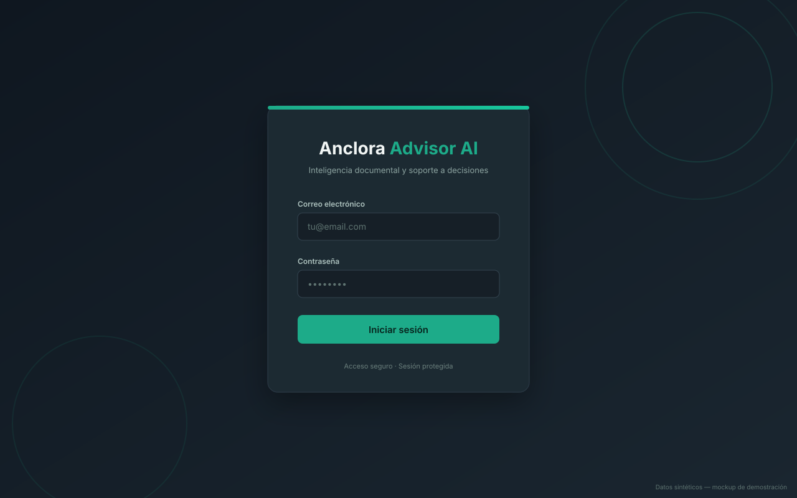

<div align="center">
  

  # Anclora Advisor AI

  **AI-powered document intelligence and decision-support platform**

  `Next.js 15` · `React 19` · `TypeScript` · `Supabase + pgvector` · `RAG` · `Multi-provider LLM`

  [Versión en español → README.md](README.md)
</div>

---

> [!IMPORTANT]
> This repository is a reduced professional showcase.
> It does not contain the operational source code, production data,
> credentials, private prompts, internal architecture details,
> or proprietary business logic of the original project.

> [!IMPORTANT]
> Este repositorio es una versión reducida para portfolio profesional.
> No contiene el código fuente operativo, datos de producción,
> credenciales, prompts privados, detalles internos de arquitectura
> ni lógica empresarial propietaria del proyecto original.

> [!NOTE]
> All data shown in this repository is fictional and used exclusively for portfolio demonstration purposes.
> Todos los datos mostrados en este repositorio son ficticios y se utilizan exclusivamente con fines de demostración profesional.

---

## The problem

Freelancers and small businesses in Spain deal daily with tax obligations, labor risk and invoicing, using information scattered across regulations, contracts and their own documents. Finding reliable answers takes time and expert judgment — and generic chat tools don't provide the traceability decisions require: an answer without a citable source is not actionable.

## The solution

Anclora Advisor AI is a web application that combines retrieval-augmented generation (RAG) over a curated knowledge base, multi-provider LLM orchestration and purpose-built work modules — cited chat, invoicing, labor risk, tax alerts and document validation — to turn complex queries into traceable, actionable answers.

The technical approach prioritizes reliability: answers cited against document sources, deterministic tools for fiscal calculations, schema-validated APIs, persisted conversations and an audit trail.

## At a glance

| Area | What it demonstrates |
|---|---|
| Generative AI | Multi-provider LLM orchestration with streaming (SSE) |
| RAG | Retrieval over a vectorized document base (pgvector), with citations and grounding level |
| Document Intelligence | Knowledge document ingestion and versioning; PDF/image invoice import via a vision model |
| Automation | Alerts, reminders, scheduled job queue and mitigation workflows |
| Software Engineering | Modular Next.js monolith, validated APIs, strict typing |
| Quality | Unit, integration and E2E tests (Playwright); RAG evaluation harness with thresholds and gate |
| Governance | Traceability (audit log), role-based access control, spec-driven development |

## High-level flow

```text
Document / Query
        ↓
Processing and normalization
        ↓
Contextual retrieval (RAG)
        ↓
LLM orchestration
        ↓
Validation and deterministic tools
        ↓
Traceable result with citations
```

## Architecture



More detail in [docs/architecture.md](docs/architecture.md).

## Screenshots (synthetic data)

| Cited RAG chat | Invoicing |
|---|---|
|  |  |

| Labor risk | Sign in |
|---|---|
|  |  |

The screenshots are mockups recreated with fictional data; they do not come from the operational environment.

## AI capabilities

- **Cited RAG**: every answer references the document fragments used, with a grounding confidence level.
- **Local embeddings**: document vectorization (384 dimensions) without external service dependency, with caching and dimension verification.
- **Multi-provider LLM**: abstraction layer over OpenAI-compatible API endpoints, with local (Ollama) and cloud (Cloudflare Workers AI, Groq) runtime profiles and model fallback.
- **Streaming**: real-time responses via Server-Sent Events.
- **Deterministic tools**: fiscal and invoicing calculations resolved by code, not by the model.
- **Vision-based document import**: PDF/image invoice reading via a VLM.
- **RAG evaluation**: harness with datasets, quality thresholds and an automatic gate for knowledge-base changes.

Technical detail in [docs/ai-capabilities.md](docs/ai-capabilities.md).

## Engineering

- **Strict typing** across the project (TypeScript `strict`).
- **Contract validation** on APIs with Zod.
- **Separation of concerns**: UI (components/hooks), application layer (API routes), AI orchestration and data access.
- **Persistence** of conversations, invoices, risk assessments and evidence.
- **Role-based access control** (admin / partner / user) with secure sessions.
- **CI** with type-check, lint and smoke tests.

## What this project demonstrates

This project demonstrates hands-on experience in:

- end-to-end product design (problem → flow → modules);
- modern web application architecture (frontend + backend + data);
- applied Generative AI: RAG, embeddings, streaming, multi-provider orchestration;
- API and external service integration (email, storage, vision models);
- document processing and validation;
- multi-level testing and AI answer-quality evaluation;
- technical documentation and spec-driven development;
- business workflow automation with traceability.

## Documentation

- [docs/product-overview.md](docs/product-overview.md) — problem, target user and value proposition
- [docs/architecture.md](docs/architecture.md) — high-level architecture
- [docs/ai-capabilities.md](docs/ai-capabilities.md) — RAG, embeddings, LLM and document processing
- [docs/engineering-decisions.md](docs/engineering-decisions.md) — engineering decisions
- [docs/security-and-privacy.md](docs/security-and-privacy.md) — security and privacy principles
- [docs/testing-and-quality.md](docs/testing-and-quality.md) — testing and quality strategy
- [examples/synthetic/](examples/synthetic/) — fictional sample data

## License

**All Rights Reserved — Portfolio Evaluation Only.**

The materials in this repository are available solely for professional evaluation (recruiting, collaboration, technical due diligence). No permission is granted for reuse, redistribution or commercial use. See [LICENSE](LICENSE).
