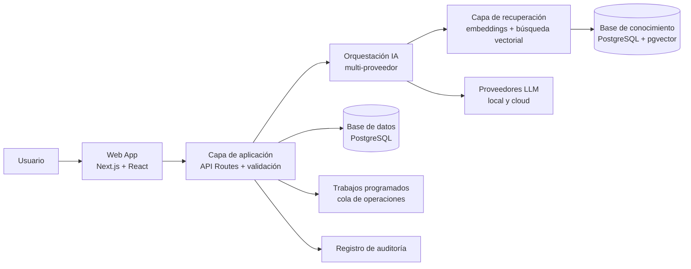
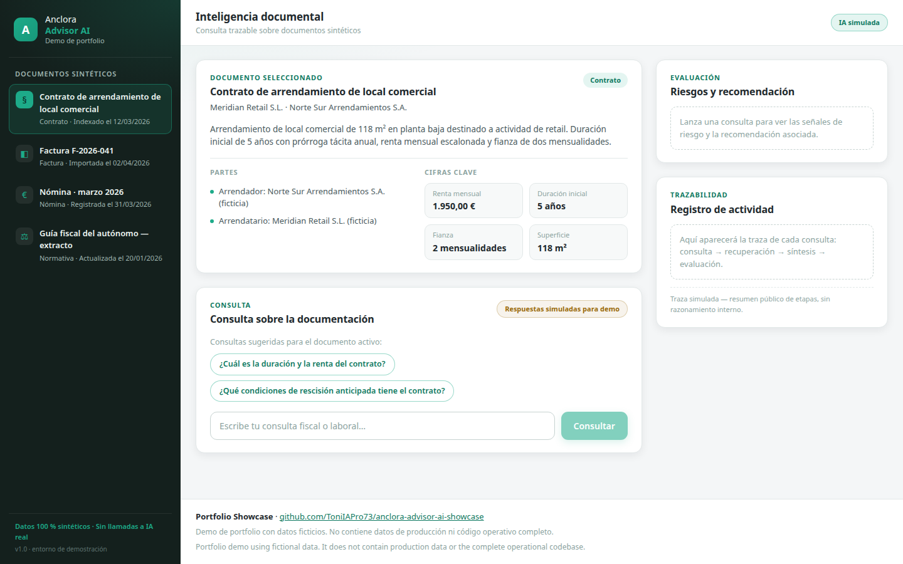
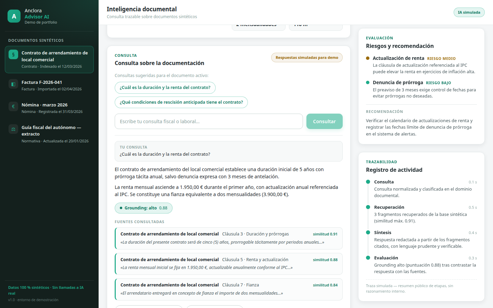
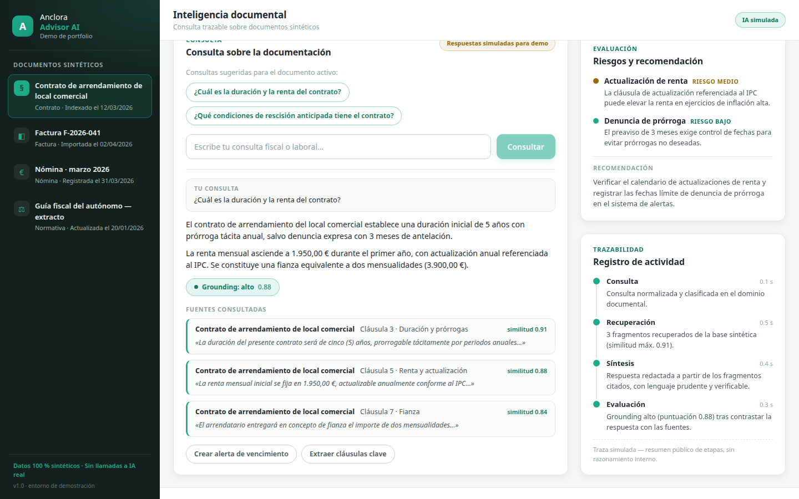
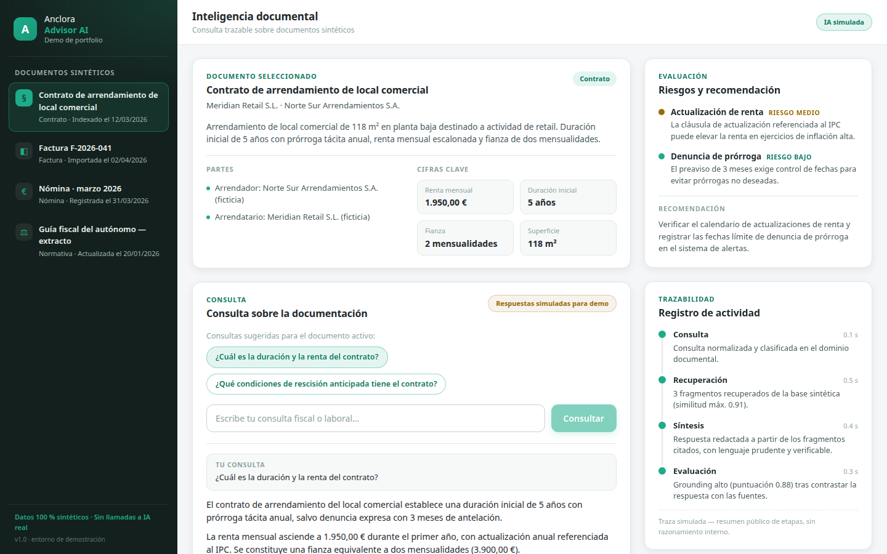

<div align="center">
  

  # Anclora Advisor AI

  **Plataforma de inteligencia documental y soporte a decisiones potenciada por IA**

  `Next.js 15` · `React 19` · `TypeScript` · `Supabase + pgvector` · `RAG` · `LLM multi-proveedor`

  [English version → README.en.md](README.en.md)
</div>

---

> [!IMPORTANT]
> Este repositorio es una versión reducida para portfolio profesional.
> No contiene el código fuente operativo, datos de producción,
> credenciales, prompts privados, detalles internos de arquitectura
> ni lógica empresarial propietaria del proyecto original.

> [!IMPORTANT]
> This repository is a reduced professional showcase.
> It does not contain the operational source code, production data,
> credentials, private prompts, internal architecture details,
> or proprietary business logic of the original project.

> [!NOTE]
> Todos los datos mostrados en este repositorio son ficticios y se utilizan exclusivamente con fines de demostración profesional.
> All data shown in this repository is fictional and used exclusively for portfolio demonstration purposes.

---

## Live Demo

**[Abrir demo en vivo → anclora-advisor-ai-showcase.vercel.app](https://anclora-advisor-ai-showcase.vercel.app)**

La demo interactiva de este showcase se ejecuta en local, sin secretos ni servicios externos:

```bash
npm install && npm run dev
```

Detalles de su arquitectura en [docs/demo-architecture.md](docs/demo-architecture.md).

## El problema

Autónomos y pequeñas empresas en España manejan a diario obligaciones fiscales, riesgo laboral y facturación con información dispersa entre normativa, contratos y documentos propios. Consultar esa información exige tiempo, criterio experto y una trazabilidad que las herramientas genéricas de chat no ofrecen: una respuesta sin fuente citable no sirve para decidir.

## La solución

Anclora Advisor AI es una aplicación web que combina recuperación aumentada (RAG) sobre una base de conocimiento curada, orquestación de modelos de lenguaje multi-proveedor y módulos de trabajo concretos — chat con citas, facturación, riesgo laboral, alertas fiscales y validación de documentos — para convertir consultas complejas en respuestas trazables y accionables.

El enfoque técnico prioriza la fiabilidad: respuestas con citas a fuentes documentales, herramientas deterministas para cálculos fiscales, validación de esquemas en las APIs, persistencia de conversaciones y registro de auditoría.

## At a glance

| Área | Qué demuestra |
|---|---|
| IA Generativa | Orquestación de LLM multi-proveedor con streaming (SSE) |
| RAG | Recuperación sobre base documental vectorizada (pgvector), con citas y nivel de grounding |
| Document Intelligence | Ingesta y versionado de documentos de conocimiento; importación de facturas PDF/imagen con modelo visual |
| Automatización | Alertas, recordatorios, cola de trabajos programados y workflows de mitigación |
| Software Engineering | Monolito modular Next.js, APIs validadas, tipado estricto |
| Calidad | Tests unitarios, de integración y E2E (Playwright); harness de evaluación RAG con umbrales y gate |
| Gobernanza | Trazabilidad (audit log), RBAC por roles, metodología de desarrollo basada en specs |

## Flujo de alto nivel

```text
Documento / Consulta
        ↓
Procesamiento y normalización
        ↓
Recuperación contextual (RAG)
        ↓
Orquestación LLM
        ↓
Validación y herramientas deterministas
        ↓
Resultado trazable con citas
```

## Arquitectura



Más detalle en [docs/architecture.md](docs/architecture.md).

## Capturas (datos sintéticos)

| Panel principal | Consulta con respuesta simulada |
|---|---|
|  |  |

| Fuentes y grounding | Riesgos y trazabilidad |
|---|---|
|  |  |

Las capturas proceden de la demo interactiva de este repositorio ejecutándose con datos ficticios (`npm install && npm run dev`).

## Capacidades de IA

- **RAG con citas**: cada respuesta referencia los fragmentos documentales utilizados, con nivel de confianza de grounding.
- **Embeddings locales**: vectorización de documentos (384 dimensiones) sin depender de servicios externos, con caché y verificación de dimensión.
- **LLM multi-proveedor**: capa de abstracción sobre endpoints compatibles con la API de OpenAI, con perfiles de ejecución local (Ollama) y cloud (Cloudflare Workers AI, Groq), y fallback entre modelos.
- **Streaming**: respuestas en tiempo real vía Server-Sent Events.
- **Herramientas deterministas**: cálculos fiscales y de facturación resueltos por código, no por el modelo.
- **Importación documental con modelo visual**: lectura de facturas en PDF/imagen mediante VLM.
- **Evaluación RAG**: harness con datasets, umbrales de calidad y gate automático para cambios en la base de conocimiento.

Detalle técnico en [docs/ai-capabilities.md](docs/ai-capabilities.md).

## Ingeniería

- **Tipado estricto** en todo el proyecto (TypeScript `strict`).
- **Validación de contratos** en las APIs con Zod.
- **Separación de responsabilidades**: UI (componentes/hooks), capa de aplicación (API routes), orquestación IA y acceso a datos.
- **Persistencia** de conversaciones, facturas, evaluaciones de riesgo y evidencias.
- **Control de acceso** por roles (admin / partner / user) con sesiones seguras.
- **CI** con type-check, lint y smoke tests.

## Qué capacidades demuestra este proyecto

Este proyecto demuestra experiencia práctica en:

- diseño de producto de principio a fin (problema → flujo → módulos);
- arquitectura de aplicaciones web modernas (frontend + backend + datos);
- IA Generativa aplicada: RAG, embeddings, streaming, orquestación multi-proveedor;
- integración de APIs y servicios externos (correo, almacenamiento, modelos visuales);
- procesamiento y validación documental;
- testing en varios niveles y evaluación de calidad de respuestas IA;
- documentación técnica y desarrollo guiado por especificaciones;
- automatización de workflows de negocio con trazabilidad.

## Documentación

- [docs/product-overview.md](docs/product-overview.md) — problema, usuario y propuesta de valor
- [docs/architecture.md](docs/architecture.md) — arquitectura de alto nivel
- [docs/demo-architecture.md](docs/demo-architecture.md) — arquitectura de la demo interactiva (datos sintéticos)
- [docs/ai-capabilities.md](docs/ai-capabilities.md) — RAG, embeddings, LLM y procesamiento documental
- [docs/engineering-decisions.md](docs/engineering-decisions.md) — decisiones de ingeniería
- [docs/security-and-privacy.md](docs/security-and-privacy.md) — principios de seguridad y privacidad
- [docs/testing-and-quality.md](docs/testing-and-quality.md) — estrategia de testing y calidad
- [examples/synthetic/](examples/synthetic/) — datos de ejemplo ficticios

## Licencia

**All Rights Reserved — Portfolio Evaluation Only.**

Los materiales de este repositorio están disponibles únicamente para evaluación profesional (reclutamiento, colaboración, due diligence técnica). No se concede permiso de reutilización, redistribución ni uso comercial. Ver [LICENSE](LICENSE).
