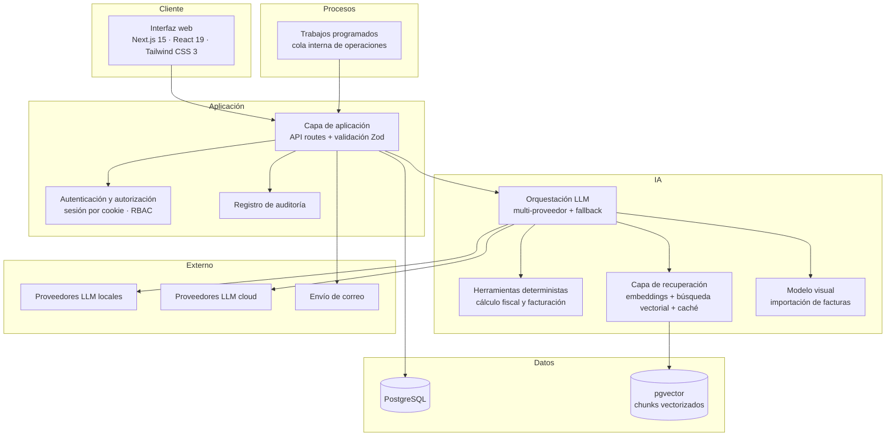

# Arquitectura de alto nivel

> Este documento forma parte de la documentación técnica del showcase. Ver contexto general en [../README.md](../README.md).

## Visión general

Anclora Advisor AI es un monolito modular construido sobre Next.js 15 (App Router) y React 19, con TypeScript en modo estricto en todo el proyecto. La persistencia y la búsqueda vectorial residen en PostgreSQL con pgvector, accedidas a través del cliente oficial de Supabase. La descripción que sigue es deliberadamente de alto nivel: se omiten rutas, configuraciones y detalles operativos.

## Capas

### Frontend

Componentes React 19 organizados por módulo de producto (chat, facturación, riesgo laboral, fiscalidad, alertas, administración), con Tailwind CSS 3 para el sistema visual. El chat consume respuestas en streaming vía Server-Sent Events, de modo que la interfaz muestra la respuesta conforme se genera.

### Capa de aplicación

API routes del propio Next.js actúan como única puerta de entrada al servidor. Cada endpoint valida su entrada con esquemas Zod antes de tocar lógica de negocio o datos: ninguna petición mal formada llega a la capa de datos. La autenticación se resuelve por sesión de cookie y la autorización por roles (admin / partner / user), verificados en servidor en cada operación.

### Orquestación de IA

Una capa de abstracción sobre endpoints compatibles con la API de OpenAI permite conmutar proveedores — perfiles locales (Ollama) y cloud (Cloudflare Workers AI, Groq) — y aplicar fallback entre modelos cuando uno no responde. Los cálculos fiscales y de facturación no los realiza el modelo: se exponen como herramientas deterministas que devuelven resultados exactos y verificables.

### Recuperación (RAG)

Los documentos de la base de conocimiento se fragmentan y vectorizan en embeddings de 384 dimensiones almacenados en pgvector. La recuperación se resuelve mediante una función RPC de similitud con fallback en JavaScript, cachés con TTL, alias de dominio para términos frecuentes y citas con metadatos de similitud. Los embeddings se generan con proveedores locales (Xenova, Ollama, Cloudflare) con verificación de dimensión.

### Base de datos

PostgreSQL como única fuente de verdad: conversaciones, facturas, evaluaciones de riesgo, evidencias, alertas, plantillas, documentos de conocimiento y registro de auditoría. Los vectores viven en la misma base (pgvector), evitando un almacén vectorial separado.

### Integraciones

- **Correo**: envío de facturas y notificaciones mediante nodemailer.
- **Generación de PDF**: facturas y documentos generados con pdf-lib.
- **Modelo visual**: importación de facturas en PDF o imagen mediante un VLM.

### Trabajos en segundo plano

Una tarea programada (cron) invoca periódicamente una cola interna de operaciones, que procesa trabajos diferidos como recordatorios, alertas fiscales y envíos pendientes. El procesamiento es idempotente y queda registrado.

## Principios estructurales

- **Una sola puerta de entrada**: toda mutación pasa por la capa de aplicación validada; el frontend nunca accede directamente a la base de datos.
- **Separación de capas**: UI, aplicación, orquestación IA y acceso a datos evolucionan de forma independiente.
- **Sustituibilidad**: proveedores de LLM y embeddings intercambiables sin tocar lógica de negocio.

## Documentos relacionados

- [ai-capabilities.md](ai-capabilities.md) — detalle de la capa de IA
- [engineering-decisions.md](engineering-decisions.md) — por qué se decidió así
- [security-and-privacy.md](security-and-privacy.md) — control de acceso y privacidad
- [demo-architecture.md](demo-architecture.md) — demo interactiva de este repo (Vite + React, datos sintéticos, sin IA real)
